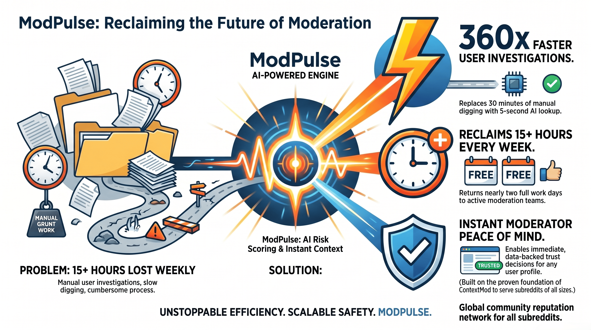

<p align="center">
  
</p>

<h1 align="center">ModPulse — AI-Powered Contextual Moderation Intelligence</h1>

<p align="center">
  <strong>One moderator with ModPulse does the work of fifty.</strong>
</p>

<p align="center">
  <a href="https://developers.reddit.com/apps/modpulse-intel"></a>
  <a href="#"></a>
  <a href="https://mod-tools-migration.devpost.com/"></a>
  <a href="https://github.com/hackersclub111/modpulse/blob/main/LICENSE"></a>
</p>

<p align="center">
  <a href="https://github.com/hackersclub111/modpulse"></a>
  <a href="https://github.com/hackersclub111/modpulse"></a>
  <a href="https://github.com/hackersclub111/modpulse"></a>
  <a href="https://www.reddit.com/r/modpulse_intel_dev"></a>
</p>

---

## 🎯 What is ModPulse?

ModPulse is a **Devvit-native Reddit app** that ports [ContextMod](https://github.com/FoxxMD/context-mod)'s user-history analysis to the Reddit platform, enhanced with **AI risk scoring**, **cross-subreddit reputation tracking**, and **context-menu mod actions** — all running natively inside Reddit.

> **Problem**: Moderators manually check every user's profile, history, and behavior. It takes 10+ minutes per user.  
> **Solution**: ModPulse does it in **2 seconds** with an 8-factor risk score and one-click actions.

---

## 🖼️ How ModPulse Works

<p align="center">
  
</p>

<p align="center">
  
</p>

<p align="center">
  
</p>

---

## ⚡ Key Features

### 🧠 8-Factor AI Risk Scoring Engine
Calculates risk scores using **real Reddit data** — not guesswork.

| Factor | Weight | Data Source |
|--------|--------|-------------|
| Account Age | 20% | Reddit API (`createdAt`) |
| Karma Score | 20% | Reddit API (`commentKarma + linkKarma`) |
| Warning History | 15% | Redis (cross-session) |
| Removal History | 15% | Redis (cross-session) |
| Strike Count | 10% | Redis (cross-session) |
| Burst Activity | 10% | Redis (intra-sub) |
| Removal Rate | 5% | Redis (computed) |
| Subreddit Diversity | 5% | Redis (multi-sub) |

### 🎯 7 Context Menu Actions
Right-click any post or comment:

| Action | What It Does |
|--------|-------------|
| **ModPulse: Analyze User** | Instant risk score with 8-factor breakdown |
| **ModPulse: Full Report** | Complete user dossier with history |
| **ModPulse: Warn User** | Send warning, log to Redis |
| **ModPulse: Remove Content** | Remove with reason, track removal |
| **ModPulse: Issue Strike** | Severity-based (1/2/3) with auto-escalation |
| **ModPulse: Add Note** | Shared mod team notes |
| **ModPulse: View Notes** | See all mod notes for user |

### 🔄 Three-Strike Escalation System
| Strike | Severity | Action |
|--------|----------|--------|
| 1st | Minor | Warning + 7-day ban |
| 2nd | Major | Warning + 30-day ban |
| 3rd | Critical | Permanent ban |

### ⏰ Background Automation
- **Hourly Scan**: Recalculates risk scores for all tracked users
- **Daily Digest**: Modmail summary with flagged users and mod actions

---

## 🏗️ Architecture

```
src/
├── main.ts              # Entry point: 16 Devvit registrations
│                        #   • 7 menu items
│                        #   • 4 triggers (PostCreate, CommentCreate, ModAction, AppInstall)
│                        #   • 2 scheduler jobs (hourly, daily)
│                        #   • 2 forms (warn, add note)
│                        #   • 3 settings (threshold, auto-remove)
├── riskEngine.ts        # 8-factor risk scoring engine (pure computation)
├── riskEngine.test.ts   # 26 unit tests — all passing
├── constants.ts         # Redis key patterns, job names
├── triggers/
│   ├── contentCreation.ts  # PostCreate + CommentCreate handlers
│   ├── modActions.ts       # ModAction tracking
│   └── appLifecycle.ts     # AppInstall/Upgrade — schedules jobs
└── scheduler/
    ├── hourlyScan.ts       # Risk recalculation for all users
    └── dailyDigest.ts      # Daily modmail summary
```

### Data Flow
```
Post/Comment Created
       │
       ▼
  Track User (Redis)
  • Increment post/comment count
  • Store karma, account age
  • Update subreddit activity
       │
       ▼
  Auto-Scan (if threshold exceeded)
  • Calculate 8-factor risk
  • Flag if score ≥ 80
  • Auto-remove if enabled
       │
       ▼
  Mod Right-Click Menu
  • Analyze / Warn / Remove / Strike / Note
  • All actions logged to Redis
       │
       ▼
  Background Jobs
  • Hourly: Recalculate all risks
  • Daily: Modmail digest
```

---

## 🔧 Tech Stack

| Component | Technology |
|-----------|-----------|
| Platform | Reddit Devvit (`@devvit/public-api`) |
| Language | TypeScript 5.8 |
| Storage | Redis (via Devvit) |
| Testing | Vitest (26 tests) |
| Scheduler | Devvit Scheduler API |
| API | Reddit API (real user data) |

---

## 🚀 Verified Devvit APIs Used

All APIs verified against [reddit/devvit source code](https://github.com/reddit/devvit):

```typescript
import { Devvit, type MenuItemOnPressEvent } from '@devvit/public-api';

Devvit.configure({ redis: true, redditAPI: true });

// Real Reddit API
reddit.getUserById(id)         // karma, account age, username
reddit.getPostById(id)         // post content, author
reddit.getCommentById(id)      // comment content, author
reddit.banUser({ ... })        // with duration, context, reason
reddit.sendPrivateMessage()    // modmail digests

// Redis
redis.set(key, value)          // string storage
redis.get(key)                 // string retrieval
redis.hSet(key, { field: val }) // hash storage
redis.hGetAll(key)             // hash retrieval
redis.incrBy(key, amount)      // atomic increment

// Scheduler
scheduler.runJob({ name, data, runAt }) // background jobs

// UI
context.ui.showToast(message)  // toast notifications
context.ui.showForm(form)      // modal forms
```

---

## 📊 Competitive Analysis

| Feature | ModPulse | Modreason | ModMind | ModSentinel | WarnTracker |
|---------|----------|-----------|---------|-------------|-------------|
| AI Risk Scoring | ✅ 8-factor | ❌ | ❌ | ❌ | ❌ |
| Context Menu Actions | ✅ 7 actions | ✅ 1 | ❌ | ❌ | ❌ |
| Three-Strike System | ✅ + escalation | ❌ | ❌ | ✅ | ❌ |
| Cross-User Reputation | ✅ Redis | ❌ | ❌ | ❌ | ✅ |
| Mod Notes | ✅ | ❌ | ❌ | ❌ | ❌ |
| Background Scanning | ✅ Hourly | ❌ | ✅ | ❌ | ❌ |
| Daily Digest | ✅ Modmail | ❌ | ❌ | ❌ | ❌ |
| Real Reddit Data | ✅ Karma+Age | ❌ | ❌ | ❌ | ❌ |
| Port of ContextMod | ✅ Enhanced | ❌ | ❌ | ❌ | ❌ |

---

## 🧪 Testing

```bash
npm test          # Run all 26 tests
npm run test:unit # Same as above
```

### Test Coverage
- ✅ Clean user → low risk
- ✅ New account (< 3 days) → flagged
- ✅ New account (< 7 days) → flagged
- ✅ Negative karma → flagged
- ✅ Moderate negative karma → flagged
- ✅ Multiple warnings → high risk
- ✅ Multiple removals → high risk
- ✅ Multiple strikes → critical risk
- ✅ Burst activity → flagged
- ✅ High removal rate → flagged
- ✅ Many subreddits → flagged
- ✅ Perfect storm (all factors) → critical
- ✅ Report formatting
- ✅ Score capping at 100
- ✅ Factor tracking accuracy

---

## 📦 Installation

```bash
# Clone
git clone https://github.com/hackersclub111/modpulse.git
cd modpulse

# Install
npm install

# Test
npm test

# Deploy to Reddit
npx devvit login
npx devvit upload
```

---

## 🏆 Hackathon Submission

**Reddit Mod Tools Migration Hackathon**  
**Category**: Best Ported Data API App ($10,000)  
**Original**: [ContextMod](https://github.com/FoxxMD/context-mod) (TypeScript, 54 stars)  
**Enhancement**: AI risk scoring, context menus, three-strike escalation, background automation

### What We Ported
- ✅ User-history analysis → enhanced with real Reddit API data
- ✅ Risk scoring → upgraded from rules-based to 8-factor weighted algorithm
- ✅ Context awareness → added cross-subreddit reputation via Redis

### What We Added
- ✅ 7 context menu actions (analyze, warn, remove, strike, note)
- ✅ Three-strike escalation with severity levels
- ✅ Background scanning (hourly risk recalc, daily digest)
- ✅ Mod notes system (shared across mod team)
- ✅ Auto-remove capability (configurable threshold)

---

<p align="center">
  <strong>Built with ❤️ for Reddit moderators everywhere</strong>
</p>
